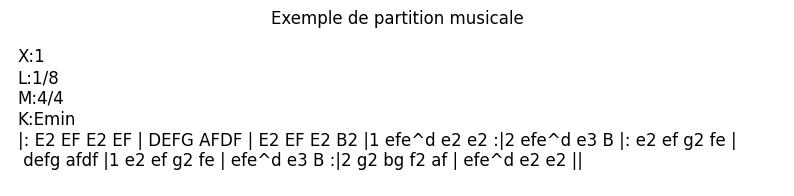
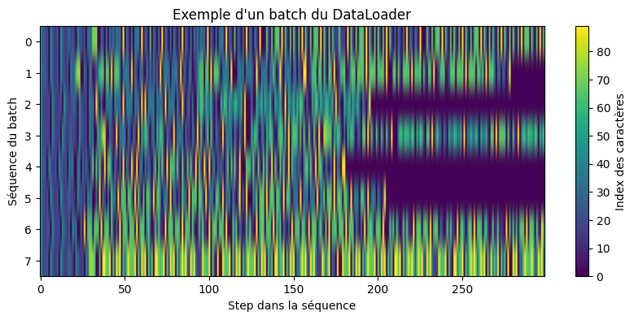
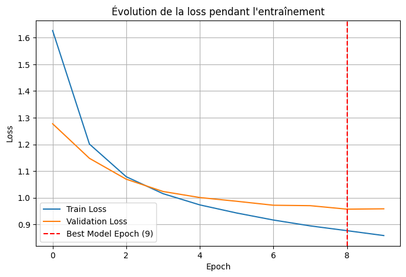
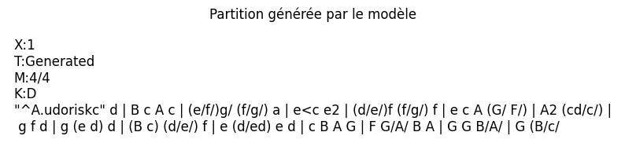

# TP 1 – Réseaux Récurrents : Génération de Musique ABC

## Introduction

Ce TP consiste à générer de la musique au format ABC en utilisant des réseaux de neurones récurrents (RNN) de type LSTM.
L’objectif est de prétraiter les données textuelles, entraîner un modèle LSTM et générer de nouvelles partitions musicales.
Le dataset contient des partitions irlandaises téléchargées depuis Hugging Face.

---

## Objectifs

* Prétraiter les partitions pour les rendre compatibles avec un RNN.
* Créer un dataset PyTorch avec séquences d’entrée et séquences cibles décalées.
* Implémenter un modèle LSTM pour prédire le prochain caractère.
* Configurer l’entraînement avec TensorBoard et early stopping.
* Générer de nouvelles partitions musicales.

---

## Chargement et exploration des données

* **Taille du train set :** 214122 chansons
* **Taille du validation set :** 2162 chansons

**Exemple d’une chanson du dataset :**

```
X:1
L:1/8
M:4/4
K:Emin
|: E2 EF E2 EF | DEFG AFDF | E2 EF E2 B2 | ...
```

**Capture d’écran :**


---

## Prétraitement des données

* Extraction des caractères uniques et création du vocabulaire (`char2idx` et `idx2char`).
* Vectorisation des partitions en indices numériques.
* Padding pour uniformiser la longueur des séquences.

---

## Dataset PyTorch et DataLoader

* Classe `MusicDataset` :

  * `__getitem__` retourne la séquence d’entrée et la séquence cible décalée.
  * `__len__` retourne la taille du dataset.
* DataLoader pour train et validation (batch size = 16).

**Capture d’écran d’un batch :**


---

## Architecture du modèle LSTM

* Couche `Embedding` pour transformer les indices en vecteurs continus.
* LSTM pour modéliser les dépendances temporelles dans la séquence.
* Couche dense (`Linear`) pour prédire le caractère suivant.

**Hyperparamètres :**

* Dimension des embeddings : 256
* Taille LSTM : 1024
* Batch size : 256
* Learning rate : 5e-3

---

## Entraînement avec Early Stopping

* Nombre maximal d’époques : 10
* Patience pour early stopping : 3
* Meilleur modèle sauvegardé : `best_model.pth` à l’epoch 9

**Évolution de la loss :**


**Résumé de l’entraînement :**

* Total epochs effectuées : 10
* Epochs restantes (non utilisées) : 0
* Meilleur modèle sauvegardé à l’epoch : 9

**Train Loss par epoch :**
`[1.6266, 1.2013, 1.0790, 1.0155, 0.9734, 0.9431, 0.9167, 0.8948, 0.8768, 0.8585]`

**Validation Loss par epoch :**
`[1.2774, 1.1480, 1.0697, 1.0237, 1.0010, 0.9870, 0.9721, 0.9705, 0.9574, 0.9588]`

---

## Génération de musique

* **Séquence de départ :**

```
X:1
T:Generated
M:4/4
K:D
```

* Longueur générée : 200 caractères

**Capture d’écran de la partition générée :**


---

## Conclusion

Ce TP a permis de :

* Préparer et vectoriser des partitions musicales.
* Créer un dataset PyTorch avec padding et séquences décalées.
* Implémenter et entraîner un modèle LSTM.
* Appliquer l’early stopping pour sauvegarder le meilleur modèle.
* Générer de nouvelles partitions musicales.